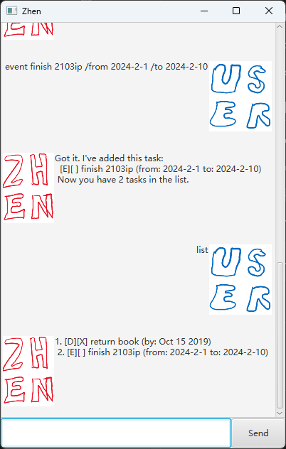

# Zhen-Chatbot User Guide



Zhen is a chatbot that allows you to manage your task easily.
To use Zhen, you need to:
1. Download the new release.
2. Go to the directory where the jar file is in.
3. Enter command line.
4. Type **java -jar Zhen.jar** to run the program.

## Adding todos: `todo`

Add a todo to your task list. 

todo is a task with only name.

Format: `todo [todo name]`.

Example: `todo buy food`.

Output:

```
Got it. I've added this task: 
[T][] buy food
Now you have 1 tasks in the list.
```

## Adding deadline: `deadline`

Add a deadline to your task list. 

deadline is a task **with due date**.

Format: `deadline [todo name] /by [due date]`.

Example: `deadline buy fish /by 2019-10-15`.

Output:

```
Got it. I've added this task:[D][] 
buy fish (by: Oct 15 2019) 
Now you have 2 tasks in the list.
```

### Notice

It is recommended you input the **due date** with format: `yyyy-mm-dd` such as `2019-10-15` (Be caution, February should be 02 not 2, and 3rd day should be 03 not 3).

However, it is OK if you don't, in that case, the program will treat it as plain text not date, and will be displayed as what it is.

Example: `deadline buy fish /by 2019/10/15`.

Output:

```
Got it. I've added this task:[D][] 
buy fish (by: 2019/10/15) 
Now you have 2 tasks in the list.
```


## Adding event: `event`

Add an event to your task list. 

event is a task with **start time** and **end time**.

Format: `event [todo name] /from [starting time] /to [ending time]`.

Example: `event buy fish /from 2019-10-15 /to 2024-2-22`.

Output:

```
Got it. I've added this task:
[E][] buy fish (from: Oct 15 2019 to: Feb 22 2024)
Now you have 1 tasks in the list.
```

### Notice

It is recommended you input the **start time** and **end time** with format: `yyyy-mm-dd` such as `2019-10-15` (Be cautions, February should be 02 not 2, and 3rd day should be 03 not 3).

However, it is OK if you don't, if any one of input date doesn't follow the format, the program will treat both date as plain text.

Example: `event buy fish /from 2019/10/15 /to 2024-2-22`.

Output:

```
Got it. I've added this task:
[E][] buy fish (from: 2019/10/15 to: 2024-2-22)
Now you have 1 tasks in the list.
```

## Mark a task: `mark`

Mark the task with specified index (you can find the index using `list` input).

Format: `mark [task index]`.

Example: `mark 1`.

Output:

```
Nice! I've marked this task as done:
[T][X] buy food
```

## Unmark a task: `unmark`

Unmark the task with specified index (you can find the index using `list` input).

Format: `unmark [task index]`.

Example: `unmark 1`.

Output:

```
Nice! I've marked this task as not done yet:
[T][] buy food
```

## Delete a task: `delete`

Delete the task with specified index (you can find the index using `list` input).

Format: `delete [task index]`.

Example: `delete 1`.

Output:

```
Noted. I've removed this task: 
[T][] buy food 
Now you have 0 tasks in the list.
```

## Find a task: `find`

Listing tasks containing keyword that user wants to find.

Format: `find [keyword]`.

Example: `find ink`.

Output:

```
Here are the matching tasks in your list:
1. [T][] buy drink
2. [D][] buy ink (by: Oct 23 2024)
```

## Tag a task: `tag`

Tag the task with specified index (you can find the index using `list` input).

Format: `tag [task index] [tag]`.

Example: `tag 1 emergent`.

Output:

```
Nice! I've add the tag to the task.
```

When you list tasks later on:

Output:
```
1. [T][ ]  see doctor # emergent
```

## List all tasks: `list`

Listing all the tasks stored by the users.

Format: `list`.

Example: `list`.

Output:

```
1. [T][ ]  see doctor # emergent
2. [T][ ]  meet friend
3. [D][ ] finish ip (by: sunday)
```

## Exit the program: `bye`

Say bye to Zhen and exit the program.

Format: `bye`.

Example: `bye`.

Output:

```
Bye
```
and the program will exit.
